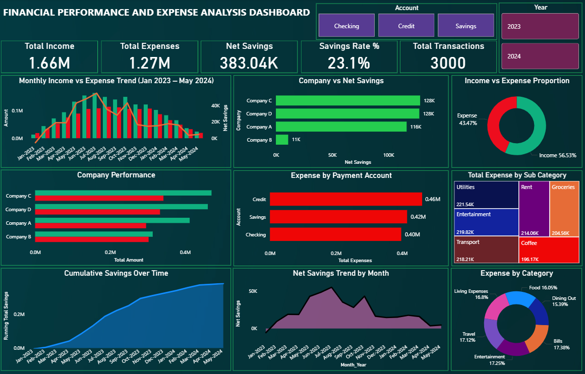
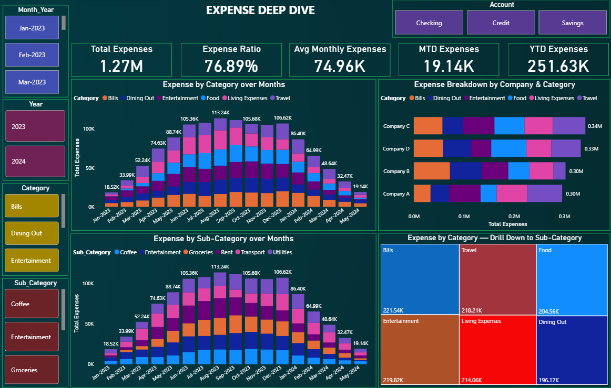
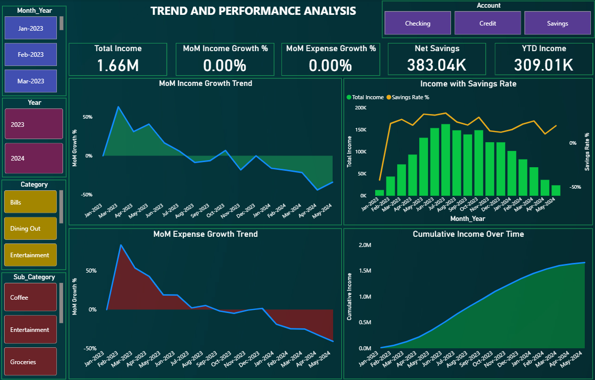

# Financial Performance & Expense Analysis Dashboard


### Power BI | Power Query | DAX | Finance Domain

---

## Objective
To analyze 3,000 financial transactions across 17 months and build an interactive Power BI dashboard for tracking income, expenses, savings trends, spending behavior, and financial performance through KPI-driven reporting and visual analytics.

---

## Tools & Technologies
| Tool | Purpose |
|---|---|
| Power BI Desktop | Dashboard & Visualization |
| Power Query | Data Cleaning & Transformation |
| DAX | Measures & KPIs |

---

## Dataset Overview
- Records: 3,000 financial transactions
- Period: January 2023 – May 2024 (17 months)
- Key Dimensions: 4 Companies, 3 Account Types, 6 Expense Categories

---

## Data Preparation
- Validated and corrected column data types
- Handled NULL values in Debit and Credit columns
- Validated Amount column sign convention
- Checked and removed duplicate rows
- Trimmed and cleaned all text columns
- Created derived columns for time-based analysis

---

## Data Model
- Architecture: Star Schema
- Fact Table: Fact_Transactions (3,000 rows)
- Dimension Table: Dim_Date (marked as Date Table)
- Relationship: One to Many — Dim_Date → Fact_Transactions
- Developed reusable DAX measures for financial KPIs, running totals, savings analysis, month-over-month growth, and time-intelligence reporting (MTD/YTD).

---

## Project Workflow

```text
Raw Financial Transactions
            ↓
Power Query Data Cleaning
            ↓
Star Schema Data Model
            ↓
DAX KPI Development
            ↓
Time Intelligence Analysis
            ↓
Interactive Power BI Dashboard
            ↓
Financial Insights
```

---

## Dashboard Preview
### Financial Performance Dashboard


### Expense Deep Dive Dashboard


### Trend & Performance Dashboard


---

## Key Business Insights
1. Overall savings rate was 23.1% across 17 months
2. Income peaked in July 2023 and declined consistently through May 2024 — sharpest drop of 44% in April 2024
3. Savings account showed 88% expense ratio — highest among all 3 accounts, indicating suboptimal account usage
4. Company B recorded highest Bills expenditure relative to its income contribution
5. All 6 expense categories remained within a 2% spend share of each other — highly balanced spending pattern
6. January 2023 was the only deficit month in the entire 17-month period

---

### Project Access

This repository showcases the project outcomes, methodology, dashboard visuals, and business insights.
To preserve the originality of the work, the following assets are not publicly distributed:
- Source datasets
- Power Query transformation steps
- Complete DAX measure library
- Power BI (.pbix) file
The repository is intended to demonstrate analytical thinking, dashboard design, data modeling, and business insight 
generation. 
Additional implementation details and technical decisions can be discussed during interviews or portfolio reviews.

---

## 👤 Author

**Victor Sarmacharjee**   
Aspiring Data Analyst

[LinkedIn](https://www.linkedin.com/in/victorsa09/)
